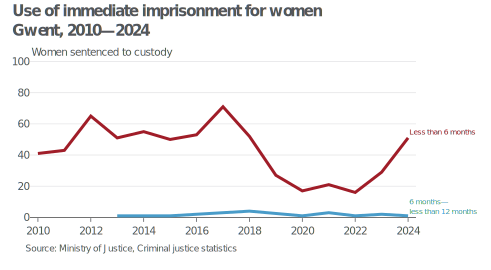
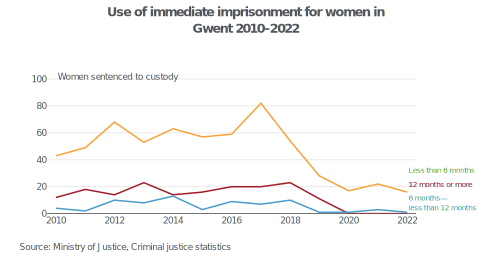

# Criminal Justice System statistics: data quality assurance

## Introduction
Through the processing of the outcomes by offence datasets, a large number of discrepancies have been observed between the newly processed data and previously published editions, requiring further investigation.

Some of the discrepancies have been more dramatic than others, and so consultation with the [Criminal Justice System statistics quarterly technical documentation](https://www.gov.uk/government/statistics/criminal-justice-system-statistics-quarterly-december-2022) has been necessary to try and understand the reasons why.

## So what did it say?
The appendix explains that since the Criminal Justice Statistics quarterly: December 2022 publication there has been a transition to more modern data processing methods, which have allowed the Ministry of Justice to resolve known issues in the tables and tools. Revised versions of the December 2022 edition interactive data tools were published in May 2023 "to ensure users have access to the revised figures for breakdowns by offence characteristics and offender demographics".

!!! quote "Technical appendix: Changes to the processing of criminal court sentencing data for Criminal Justice System Statistics Quarterly (CJSQ) publication"
    "Users should be aware that figures have been revised from 2017 onwards due to more accurate and reliable methods for data processing for information on prosecutions, convictions, sentencing and remands. **Additionally, we have made some improvements to ensure the consistency of groupings for offences,
    sentencing disposals and police force areas prior to 2017.**"

The transition to more modern data processing methods explicitly affects offence, disposal and police force area groupings for data pre-2017. [The appendix explains](https://assets.publishing.service.gov.uk/media/65bd02dd63a23d0013c8213a/criminal-justice-statistics-technical-appendix-june-2023.pdf#page=20) that the Ministry of Justice has "incorporated a new mapping between court code and Police Force Area to consistently map figures to their corresponding area" and that this has been applied to pre-2017 data as well.

## Examining the discrepancies
Discrepancies were particularly notable when visualising data on custodial sentence lengths for two of the four Welsh Police Force Areas (PFAs) — Dyfed-Powys and Gwent, which in some cases reported no cases of some sentence lengths for multiple years.

This was in contrast to our own previously published data, which included no such breaks during the time series.

Having checked figures on immediate custody for all four Welsh PFAs ['Dyfed-Powys', 'Gwent', 'North Wales', 'South Wales'], the totals between 2010–2016 are in line with the latest revised figures (±3 sentences).

*New edition*

| Police Force Area | 2010   | 2011   | 2012   | 2013   | 2014   | 2015   | 2016   |
| ------------------| ------ | -------| -------| ------ | ------ | ------ | -------|
| Dyfed Powys       | 22     | 33     | 25     | 26     | 18     | 19     | 19     |
| Gwent             | 41     | 43     | 65     | 52     | 56     | 51     | 55     |
| North Wales       | 74     | 72     | 94     | 100    | 91     | 109    | 117    |
| South Wales       | 359    | 374    | 331    | 392    | 399    | 365    | 432    |
| Grand Total       | 496    | 522    | 515    | 570    | 564    | 544    | 623    |

*Previous edition*

| Police Force Area | 2010   | 2011   | 2012   | 2013   | 2014   | 2015   | 2016   |
| ------------------| -------|--------|--------|--------|--------|--------|--------|
| Dyfed Powys       | 48     | 58     | 42     | 44     | 37     | 33     | 32     |
| Gwent             | 59     | 69     | 92     | 84     | 90     | 76     | 88     |
| North Wales       | 71     | 70     | 93     | 98     | 91     | 106    | 115    |
| South Wales       | 317    | 324    | 288    | 341    | 343    | 327    | 387    |
| Grand Total       | 495    | 521    | 515    | 567    | 561    | 542    | 622    |

However, there has been a redistribution away from Dyfed-Powys and Gwent towards South Wales, quite possibly to do with Crown Court availability and women being sentenced in a different PFA. This could also see some women in Gwent and Dyfed-Powys possibly being sentenced in England e.g. Gloucestershire, Devon, Merseyside, rather than in another Welsh PFA.

## So what does this mean?
Whilst content that the discrepancies are not the result of a processing error on our part, and we are content to use this data, its presentation will require further discussion. We may choose to (a) exclude entirely, (b) exclude from the overall tables, (c) simply include a note to highlight this anomaly. Either way, the discrepancies will need to be acknowledged in the publication to reassure users of the accuracy of the published data, and explain why these differences exist.