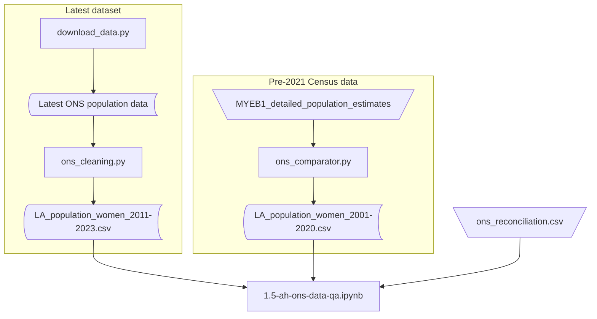

# ONS Estimates of the population for England, and Wales: data quality assurance

## Introduction

As part of the quality assurance of the data processing stages for the ONS mid-year population estimates, comparison with our earlier dataset has been undertaken. This has revealed that 94.9% of local authority records had a difference in their recorded population figure of ±5% between the previously published dataset (rolled-forward estimates) and the most recent official population estimates for England and Wales, based on Census 2021 data.

Further exploration of the reasons behind the differences have been undertaken through consultation with the accompanying dataset notes and the [ONS' own reconciliation](https://www.ons.gov.uk/peoplepopulationandcommunity/populationandmigration/populationestimates/articles/reconciliationofmidyearpopulationestimateswithcensus2021atlocalauthoritylevel/2023-03-02) of population estimates following the 2021 Census.

## So what did it say?

The ONS refers to two main mid-year estimates (MYE) of population.

1. **Census-based MYEs** are the official mid-2021 population estimates, these are based on the 2021 Census for England and Wales. These provide the most accurate estimate of the population and therefore the reliability of MYEs is very high immediately following a census.

2. **Rolled-forward MYEs** use the population estimate from the previous reference date as the starting point for estimating the population at the current reference date. The previous population estimate is aged on and data on births, deaths and migration are used to reflect population change during the reference period.

As part of their reconciliation the ONS compared the official 2021 Census-based MYE and the 2021 rolled-forward MYE at local authority level. They found that 89.12% of local authorities had a difference in their population of less than positive or negative 4.99% when comparing the two datasets.

At the local authority level, the rolled-forward MYE were more likely to overestimate males than females compared with the census-based mid-year estimates.

!!! abstract "Reconciliation of mid-year population estimates with Census 2021 at local authority level"
    "Differences between population estimates based on Census 2021 data and annual mid-year population estimates are expected."

Whist the ONS did not seek to attribute those differences to any specific cause, citing the complexity of determining the patterns of difference. It did highlight that those with the largest discrepancies "tend to be larger in areas of high population churn such as areas with significant student populations or large urban areas."

!!! abstract "Reconciliation of mid-year population estimates with Census 2021 at local authority level"
    Areas with the largest differences between estimates can generally be attributed to one of three groups:

    - LAs in London
    - LAs with a large student population
    - LAs with a special population (presence of military personnel, for example)

    Differences in these areas are likely to be partially attributed to high population churn. It is worth noting that similar areas do not show a unifying pattern, with LAs in London presenting large positive (Camden) and negative (Ealing) differences.

## Examining the population data
A similar reconciliation exercise [as the ONS' above](#so-what-did-it-say) was undertaken to compare the population of adult women computed using:

1. the older pre-2021 Census rolled-forward MYEs with...
2. the latest available dataset.

### Data sources

* The pre-2021 Census data requires a manual download of the data and can be found within the zip file of the [Mid-2001 to mid-2020 detailed time series edition of this dataset](https://www.ons.gov.uk/peoplepopulationandcommunity/populationandmigration/populationestimates/datasets/populationestimatesforukenglandandwalesscotlandandnorthernireland).

* The latest population dataset is downloaded by the `download_data.py` script.

### Data processing
Both datasets required some light processing before the quality assurance could be completed. The data processing steps for the latest ONS population dataset are explained in more detail in the [Processing the data](../getting-started/processing-the-data.md#ons-mid-year-population-estimates) section. 

Once the necessary processing was completed the datasets were then read in to `1.5-ah-ons-data-qa.ipynb`. This Jupyter Notebook documents the steps taken to compare the values, including:

1. Both datasets were filtered to only include years of overlap, in this case 2011–2020.
2. The datasets were merged to allow for comparison of the population values between the two datasets.
3. Actual, absolute and percentage differences between the two were then calculated, and a computed boolean column was added to evaluate which records had an absolute difference of <=5%.
4. Summary statistics were produced to identify the proportion of records within and outside the target variance.
5. Comparative analysis and matching was conducted against the ONS' own [reconciliation analysis](https://www.ons.gov.uk/peoplepopulationandcommunity/populationandmigration/populationestimates/articles/reconciliationofmidyearpopulationestimateswithcensus2021atlocalauthoritylevel/2023-03-02#local-authorities-with-the-largest-differences) following Census-2021.

!!! info "Results"
    Of the 3,140 successfully merged records, 2,980 (94.90%) were within a ±5% variance.

    Of the 314 Local Authorities represented in the merged dataframe, 42 showed at least one instance of variance over and above the 5% target (13% of all LAs in the data).

    For comparison the ONS' reconciliation analysis found 36 Local Authorities with a percentage difference of larger than positive or negative 5% between the 2021 rolled-forward and 2021 Census-based mid-year estimates.

    The ONS list of the 36 Local Authorities was compared against our 42, and 24 of them matched (66%).

    Whilst this is an imperfect test, it does show a reasonably high level of correlation.

## So what does this mean?
Following the QA we can be confident that the level of variation is limited, and that similar differences have been observed by the ONS in its rebasing of the MYE following the 2021 Census. 

In the next section, we examine whether this has a significant impact on previously published rates of imprisonment once Local Authority population data has been matched to Police Force Areas.